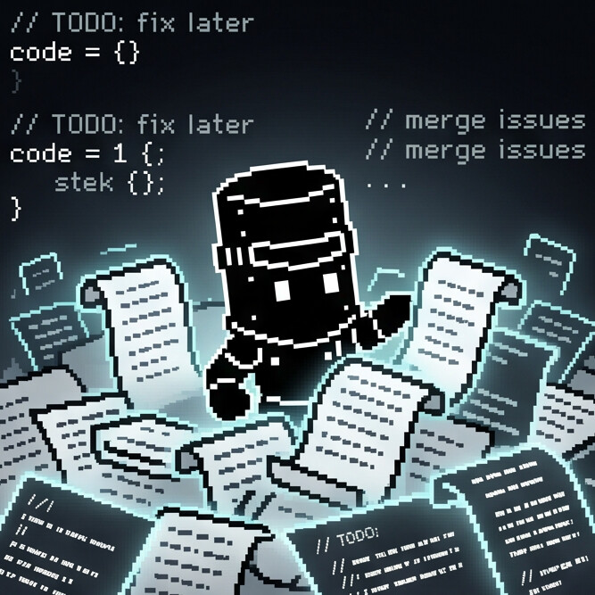
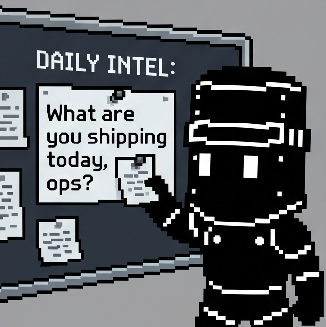

<p align="center">
  
</p>

<h1 align="center">OpenWar</h1>

<p align="center"><strong>A framework and a runtime for agent behavior that doesn't go off the rails.</strong></p>

<p align="center">
  <a href="https://github.com/pythonluvr/openwar/releases"></a>
  <a href="https://github.com/pythonluvr/openwar/actions"></a>
  <a href="https://www.npmjs.com/package/@pythonluvr/openwar"></a>
  <a href="https://discord.gg/ku6GJS92V2"></a>
  <a href="LICENSE"></a>
</p>

Most agent frameworks try to make agents feel smarter. OpenWar tries to make them behave better.

It replaces eager-customer-service-rep defaults with the behavior of a senior peer. The agent confirms briefs before acting, breaks work into phases, asks before doing anything destructive, and writes like an adult who's busy. The runtime catches the moments where the agent would otherwise skip those rules and asks it to restate.

Discipline, not intelligence. Kubernetes for agents, not a smarter brain.

<p align="center">
  
  <br />
  <em>Default agent behavior. Sycophantic, eager, drowning in half-finished context.</em>
</p>

## What OpenWar is not

Not a smarter model. OpenWar runs on top of whatever agent you already use: a local CLI agent (Claude Code, Codex CLI, Gemini CLI, aider) via the cli-bridge adapter, or any BYOK API (Anthropic, OpenAI, Gemini, Grok, or openai-compat for local Ollama and vLLM). The model's reasoning quality is the model's problem.

Not a memory system or knowledge base. Persistent project memory is planned for v0.6, but the current scope is behavioral discipline, not cognitive infrastructure.

Not an autonomous-agent platform. OpenWar's whole design assumes the operator is in the loop. Auto-pilot mode just makes the loop quieter; it never removes the operator's right to stop the run.

---

## Try it with zero setup

Three ways to use OpenWar without an API key, a paid call, or even Node:

**1. As a system prompt.** Paste [`openwar.md`](./openwar.md) into Claude Code's CLAUDE.md, Cursor's rules, or any agent's system prompt. The framework activates immediately on whatever model that tool already uses.

```bash
curl -fsSL https://raw.githubusercontent.com/pythonluvr/openwar/main/openwar.md >> ~/.claude/CLAUDE.md
```

**2. Against a local model.** If you already run Ollama, llama.cpp, vLLM, or LM Studio:

```bash
npx @pythonluvr/openwar run examples/creative-brief.md \
  --adapter openai-compat \
  --base-url http://localhost:11434/v1 \
  --model llama3.1
```

**3. Just validate a brief.** No model call, just the framework's lint pass:

```bash
npx @pythonluvr/openwar validate examples/multi-agent-brief.md
```

<p align="center">
  
  <br />
  <em>Phase 0 in one image. What are you shipping today, ops?</em>
</p>

## Quick start with a local CLI agent

If you already have Claude Code, Codex CLI, Gemini CLI, aider, or any other agent CLI on your machine, OpenWar can drive it. No cloud key, no extra subscription, the CLI uses whatever auth it already has.

```bash
npx @pythonluvr/openwar run examples/cli-bridge-brief.md \
  --adapter cli-bridge \
  --cli-binary claude
```

OpenWar spawns the binary, pipes the prompt in via stdin, applies the phase machine to its output. Same CLI agent you use today, now operating-disciplined. The brief needs `shell_exec` in `authorized_costs` because every cli-bridge invocation shells out a child process.

Swap `claude` for `gemini`, `codex`, or any other binary on PATH. See [docs/adapters.md](./docs/adapters.md) for the full cli-bridge config.

## Quick start with a cloud key

```bash
npx @pythonluvr/openwar run examples/creative-brief.md --adapter anthropic
```

Or install globally:

```bash
npm install -g @pythonluvr/openwar
export ANTHROPIC_API_KEY=...
openwar run examples/engineering-brief.md
```

Available adapters: `anthropic`, `openai`, `gemini`, `grok`, `openai-compat`. Full adapter details + env vars in [docs/adapters.md](./docs/adapters.md).

## What the runtime enforces

<p align="center">
  
  <br />
  <em>Every turn passes through deterministic detectors. No second LLM, no judging.</em>
</p>

| Phase   | What happens                                                                                     | What blocks |
|---------|--------------------------------------------------------------------------------------------------|-------------|
| Phase 0 | Agent must produce a Confirmation Summary with Objective / Deliverables / Constraints / Tools / Unknowns. | No execution until the operator accepts. |
| Phase 1 | Agent executes step by step. Gated mode pauses between steps; auto-pilot runs through clean ones. | Banned phrases warn. |
| Phase 2 | If the agent declares it's blocked, the runtime halts the session and persists state. | Resume with `openwar resume <brief_id>`. |
| Phase 3 | If the agent announces intent to do something destructive or out-of-directive, the runtime stops and asks for explicit yes. | Authorization can be pre-approved per category in the brief's `authorized_costs`. |
| Phase 4 | Agent produces a concise completion report. | None. |

If the agent skips the Confirmation Summary, the runtime asks it to restate before letting execution start.

## Documentation

| Topic | Doc |
|---|---|
| The framework itself (paste this anywhere) | [`openwar.md`](./openwar.md) |
| Full CLI reference + flags | [`docs/cli.md`](./docs/cli.md) |
| Brief format (YAML schema + categories) | [`docs/brief-format.md`](./docs/brief-format.md) |
| Adapters (Anthropic, OpenAI, Gemini, Grok, openai-compat, cli-bridge) | [`docs/adapters.md`](./docs/adapters.md) |
| Native tools and MCP | [`docs/tools.md`](./docs/tools.md) |
| Observability and tracing (v0.8+) | [`docs/observability.md`](./docs/observability.md) |
| Multi-agent orchestration (roles, budgets, per-role adapter mixing) | [`docs/multi-agent.md`](./docs/multi-agent.md) |
| Use OpenWar as a library (TypeScript) | [`docs/library.md`](./docs/library.md) |
| System-prompt-only path (no install) | [`docs/system-prompt.md`](./docs/system-prompt.md) |
| Reference briefs you can run end-to-end | [`examples/`](./examples) |
| Full release notes per version | [`CHANGELOG.md`](./CHANGELOG.md) |

## Why both a framework AND a runtime

Behavioral overlays are easy to ignore. A model that's been told "always produce a Confirmation Summary" will sometimes skip it under context pressure or specific phrasing. The runtime catches the skip and asks the model to restate.

System prompts cost nothing to install and work with any agent. The runtime is heavier, but it actually enforces the rules.

<p align="center">
  
  <br />
  <em>Phase 4 completion. WarBit ships.</em>
</p>

## Versioning

Current: **v0.8.0**. See [CHANGELOG.md](./CHANGELOG.md) for full release notes.

- v0.1: framework doc only (single markdown file).
- v0.2: runtime, CLI, BYOK adapters.
- v0.3: native tools + MCP client + Phase 3 destructive flag for unauthorized tool calls.
- v0.4: multi-agent orchestration. Planner / executor / reviewer / critic. Budgets. Resumable mid-state sessions.
- v0.5: cli-bridge adapter. OpenWar coordinates CLI agents (Claude Code, Codex CLI, Gemini CLI, aider) the same way it coordinates LLM adapters.
- v0.5.1: per-role adapter mixing. A single brief can pin each role to its own adapter and model.
- v0.6: persistent project memory across briefs.
- v0.7: cli-bridge MCP-server-mode (Claude Code, Gemini CLI, Codex CLI) + Claude Code permission auto-setup + symmetric memory tools.
- v0.8: structured trace event stream, focused `openwar inspect` modes, `openwar replay` (no LLM calls), opt-in local dashboard.
- v0.9 (planned): operator-policy-driven adaptive autonomy on top of v0.8 trace history.

Drop-in upgrades preserve compatibility within a major version. Major bumps may rename phases or change the brief format.

## Community

Questions, bug reports, framework discussion: [Discord](https://discord.gg/ku6GJS92V2). Issues and PRs welcome on this repo too.

## License

[MIT](./LICENSE). Use it, modify it, fork it, ship your own variants, paste it into commercial products. No obligations beyond keeping the copyright notice.

## Authorship

OpenWar is the framework that ships inside [War Room](https://github.com/pythonluvr/war-room), authored across many iterations of running real agent work. This standalone repo exists so people who don't use War Room can still adopt the framework.

<p align="center">
  
  <br />
  <em>Issues and PRs welcome. WarBit will read them in the morning.</em>
</p>
